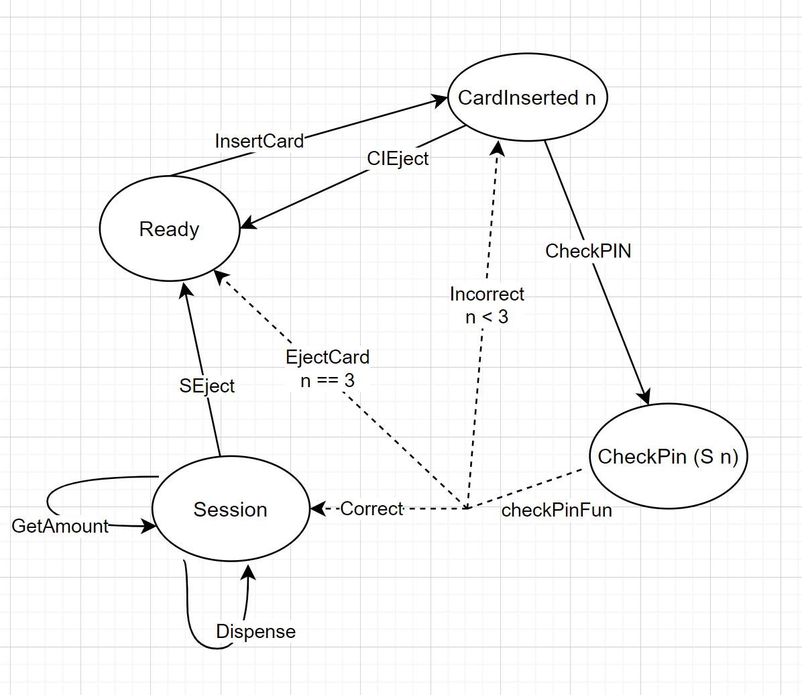

typed-fsm
==========

typed finite-state machine

Advantages of type-fsm
1. Focus on the right message

2. Top-to-bottom design for easy refactoring

3. Conducive to building complex state machine systems

  + Type guarantees will not produce incorrect function calls when written
  + With the help of the type system, we can define many state processing functions and then call each other recursively with confidence.

4. There is a sanity check. If you miss some items for pattern matching, the compiler will issue a warning, and there will also be a warning for invalid items.

[Detailed design explanation](./more-en.md)

[详细设计解释](./more.md)

# Run example
## Install ghc 9.10.1
This library requires you to update the ghc version to 9.10.1.

Install ghc 9.10.1 using ghcup 
```shell
ghcup install ghc 9.10.1
```

## 1. Mouse Motion Example

[exmaple explanation](./more-en.md)
### cabal run motion  --flags="BuildExample"

## 2. ATM FSM Example
Original design:

[confidence-in-types](https://github.com/CodingCellist/talks/blob/main/2024-03-06-spls-st-andrews/confidence-in-types.pdf)

My design:

### cabal run atm  --flags="BuildExample"

result:

