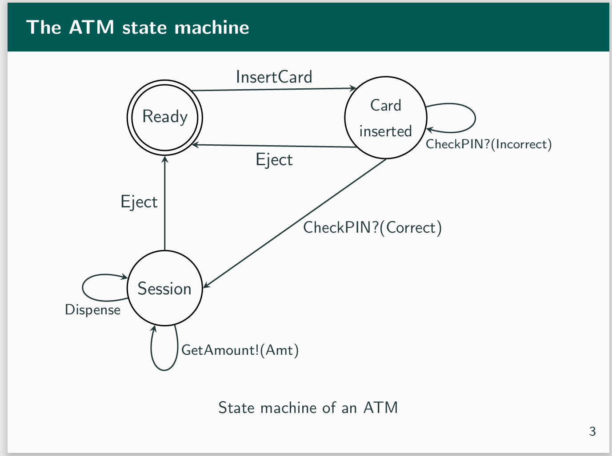

# ATM FSM Example
Original design:

[confidence-in-types](https://github.com/CodingCellist/talks/blob/main/2024-03-06-spls-st-andrews/confidence-in-types.pdf)

My design:

result:

# Run example
cabal run atm