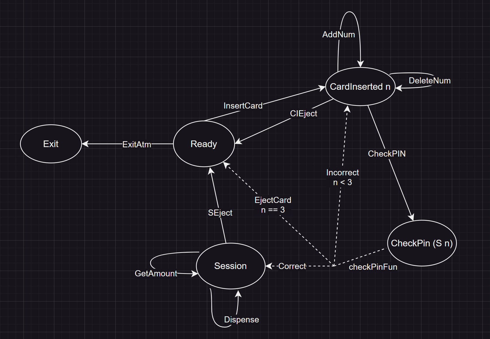

# typed-fsm example: ATM

[Actual code](https://github.com/sdzx-1/typed-fsm/tree/main/examples/ATM)

Run example
```shell
cabal run atm
```
Note: defaulte pin is 1234

# Example explanation
This is an example of an ATM, and its logic is:
1. Insert a bank card
2. Enter a PIN
3. Check balance or withdraw money

Here are some instructions:
+ In steps 2 and 3, you can choose to return the card
+ At the password input stage, a maximum of three attempts are allowed. If the password is entered incorrectly three times, the card will be returned directly

My goal is to track the number of attempts in the type and statically ensure that no more than three attempts are made during the password input stage.

I use typed-fsm. If you are not familiar with it, you can read my previous article introducing typed-fsm.

Using typed-fsm will go through the following five steps:

1. Define the state

2. Define the state transition message

3. Build the state processing function

4. Build the event-to-message function under different states

5. Run the state processing function

Let's get started.

# 1. Define the state

```haskell
$( singletons
    [d|
      data N = Z | S N
        deriving (Show, Eq, Ord)

      data ATMSt
        = Ready
        | CardInserted N
        | CheckPin N
        | Session
        | Exit
        deriving (Show, Eq, Ord)
      |]
 )
```
Define a natural number N to track the number of attempts. Here ATMSt has five states, which I will introduce in detail in conjunction with the state transition message.

# 2. Define the state transition message
First, the state transition diagram:



The ellipse represents the state, the solid arrow represents the message (the message causes the state change), and the dotted arrow represents the function. 

Here is the function checkPinFun, which checks the value of the input Pin and the number of attempts, and determines the state based on the information of these two. 

**The** number of attempts here is a type, which is used to statically guarantee that the number of attempts does not exceed three (static guarantee means compile-time guarantee).

The actual code is as follows:
```haskell
instance StateTransMsg ATMSt where
  data Msg ATMSt from to where
    ExitATM :: Msg ATMSt Ready Exit
    InsertCard :: Msg ATMSt Ready (CardInserted Z)
    CIEject :: Msg ATMSt (CardInserted n) Ready
    ---------------
    AddNum :: Int -> Msg ATMSt (CardInserted n) (CardInserted n)
    DelectNum :: Msg ATMSt (CardInserted n) (CardInserted n)
    CheckPIN :: [Int] -> Msg ATMSt (CardInserted n) (CheckPin (S n))
    ---------------
    GetAmount :: Msg ATMSt Session Session
    Dispense :: Int -> Msg ATMSt Session Session
    SEject :: Msg ATMSt Session Ready

```

# 3. Build state processing function
```haskell

readyHandler :: Op ATMSt InternalState IO () Exit Ready
readyHandler = I.do
  msg <- getInput
  case msg of
    InsertCard -> I.do
      liftm $ tmpPin .= []
      cardInsertedHandler
    ExitATM -> returnAt ()

removeOne :: [a] -> [a]
removeOne [] = []
removeOne (_ : xs) = xs

cardInsertedHandler
  :: (SingI n)
  => Op ATMSt InternalState IO () Exit (CardInserted n)
cardInsertedHandler = I.do
  msg <- getInput
  case msg of
    CIEject -> readyHandler
    AddNum i -> I.do
      liftm $ tmpPin %= (i :)
      cardInsertedHandler
    DelectNum -> I.do
      liftm $ tmpPin %= removeOne
      cardInsertedHandler
    CheckPIN i -> I.do
      res <- checkPinFun i
      case res of
        EjectCard _ -> readyHandler
        Incorrect -> cardInsertedHandler
        Correct -> I.do
          liftm $ amountLabel . label .= ("Amount: -- ")
          sessionHandler

sessionHandler :: Op ATMSt InternalState IO () Exit Session
sessionHandler = I.do
  msg <- getInput
  case msg of
    GetAmount -> I.do
      liftm $ do
        am <- use amount
        amountLabel . label .= ("Amount: " <> show am)
        liftIO $ putStrLn ("-> User Amount: " <> show am)
      sessionHandler
    Dispense i -> I.do
      liftm $ do
        amount -= i -- need to check amount is enough?
        liftIO $ putStrLn ("-> Use dispense " ++ show i)
        am <- use amount
        amountLabel . label .= ("Now Amount: " <> show am)
        liftIO $ putStrLn ("-> Now User Amount: " <> show am)
      sessionHandler
    SEject -> readyHandler
```
The above is the processing code for the three main states. You can see that it is almost a direct translation of the semantics. At the same time, how the type system ensures the correctness of the code can be seen in my previous article: Advantages of typed-fsm.

Here we focus on the checkPinFun function.
```haskell

-- Constraint requiring the number of attempts to be less than three
type family Less3 (n :: N) :: Constraint where
  Less3 Z = ()
  Less3 (S Z) = ()
  Less3 (S (S Z)) = ()
  Less3 _ = TypeError (Text "test must less 3")

data CheckPINResult :: ATMSt -> Type where
  -- EjectCard requires the number of attempts to be equal to three. Any number less or greater will result in a compile error.
  EjectCard :: (n ~ S (S (S Z))) => SN n -> CheckPINResult Ready
  -- Incorrect The number of attempts required is less than three. Here it can only be one or two. A failed third attempt will result in a direct ejection of the card (EjectCard).
  Incorrect :: (SingI n, Less3 n) => CheckPINResult (CardInserted n)
  Correct :: CheckPINResult Session


-- Helper function for handling first and second input
checkResult
  :: forall n
   . (SingI n, Less3 n)
  => Int
  -> Operate (StateT InternalState IO) CheckPINResult (CheckPin n)
checkResult i = I.do
  At userPin <- liftm $ use pin
  if i == userPin
    then LiftM $ pure (ireturn Correct)
    else LiftM $ pure (ireturn (Incorrect @n))

-- This function is affected by two parameters i and n. i represents the external input Pin, which is a dynamic influence, and n represents the number of attempts, which is a static influence.
-- The code here completes the requirements: dynamic check for i and static check for n.
checkPinFun
  :: forall (n :: N)
   . (SingI n)
  => Int
  -> Operate (StateT InternalState IO) CheckPINResult (CheckPin (n :: N))
checkPinFun i = I.do
  case sing @n of
    SS SZ -> checkResult i
    SS (SS SZ) -> checkResult i
    sn@(SS (SS (SS SZ))) -> I.do
      At userPin <- liftm $ use pin
      if i == userPin
        then LiftM $ pure (ireturn Correct)
        else LiftM $ do
          liftIO $ putStrLn "-> test 3 times, eject card!"
          pure (ireturn (EjectCard sn))
    _ -> error "np"

```

# 4. Build functions from events to messages in different states

Here we use SDL2 to build an interactive program. We need to convert SDL2 events to messages required by the ATMst state machine. The messages received in different states are different, so different messages will be generated in different states. typed-fsm uses dependent-map to ensure that no wrong messages are generated.

```haskell
mkSomeMsg
  :: forall ps (from :: ps) (to :: ps)
   . (SingI to) => Msg ps from to -> Maybe (SomeMsg ps from)
mkSomeMsg msg = Just (SomeMsg (sing @to) msg)

scEventHandler
  :: (SingI n, Less3 n)
  => Proxy n
  -> GenMsg ATMSt InternalState MyEvent (CardInserted n)
scEventHandler _ =
  GenMsg
    ( \ist event -> case event of
        MyMouseLeftButtonClick (fmap fromIntegral -> p) ->
          if
            | (ist ^. ejectLabel . rect) `contains` p -> mkSomeMsg CIEject
            | otherwise ->
                let nls = ist ^. nlabels
                    rs = filter (\(NLabel r _) -> r `contains` p) nls
                 in case rs of
                      [] -> Nothing
                      NLabel _r i : _ -> case i of
                        10 -> mkSomeMsg DelectNum
                        11 -> mkSomeMsg (CheckPIN $ reverse (ist ^. tmpPin))
                        _ -> mkSomeMsg $ AddNum i
    )

atmDepMap :: State2GenMsg ATMSt InternalState MyEvent
atmDepMap =
  D.fromList
    [ SReady
        :=> GenMsg
          ( \ist event -> case event of
              MyMouseLeftButtonClick (fmap fromIntegral -> p) ->
                ( if
                    | (ist ^. insCardLabel . rect) `contains` p -> mkSomeMsg InsertCard
                    | (ist ^. exitLabel . rect) `contains` p -> mkSomeMsg ExitATM
                    | otherwise -> Nothing
                )
          )
    , SCardInserted SZ :=> scEventHandler Proxy
    , SCardInserted (SS SZ) :=> scEventHandler Proxy
    , SCardInserted (SS (SS SZ)) :=> scEventHandler Proxy
    , SSession
        :=> GenMsg
          ( \ist event -> case event of
              MyMouseLeftButtonClick (fmap fromIntegral -> p) ->
                if
                  | (ist ^. ejectLabel . rect) `contains` p -> mkSomeMsg SEject
                  | (ist ^. getAmountLabel . rect) `contains` p -> mkSomeMsg GetAmount
                  | (ist ^. dispenseLabel . rect) `contains` p -> mkSomeMsg (Dispense 100)
                  | otherwise -> Nothing
          )
    ]
```

# 5. Run state processing function

The run state consists of two parts:

1. Initialization state: initialize window, font, renderer
```haskell

main :: IO ()
main = do
  initialize [InitVideo]
  Font.initialize
  font <- Font.load "data/fonts/SourceCodePro-Regular.otf" 20
  window <- createWindow "test" defaultWindow
  renderer <- createRenderer window (-1) defaultRenderer
  ccref <- initCharCache

  runStateT
    (appLoop (DrawEnv renderer font ccref) (SomeOperate readyHandler))
    initInternState
  destroyWindow window

```
2. Event loop: processing events -- rendering state
```haskell

appLoop :: DrawEnv -> SomeOp ATMSt InternalState IO () -> StateT InternalState IO ()
appLoop de@(DrawEnv renderer _font _ccref) (SomeOperate sinput fun) = do
  events <- pollEvents
  -- liftIO $ print events
  v <- runOp atmDepMap (makeMyEvent events) sinput fun
  case v of
    Finish _ -> pure ()
    ErrorInfo (NotFoundGenMsg (SomeSing si)) ->
      liftIO $ putStrLn $ "error: not match GenMsg " ++ show si
    Cont fun1 -> do
      let atmSt = getSomeOperateSt fun1
      rendererDrawColor renderer $= V4 0 0 0 255
      clear renderer

      rendererDrawColor renderer $= V4 255 0 155 255
      liftIO $ drawStrings de [show atmSt] (10, 30)

      ist <- M.get
      case atmSt of
        Ready -> do
          liftIO $ drawLabel de (ist ^. insCardLabel)
          liftIO $ drawLabel de (ist ^. exitLabel)
        CardInserted _n -> do
          let ls = ist ^. tmpPin
          liftIO $ drawLabel de (Label (Rect 10 90 300 30) (show $ reverse ls))
          liftIO $ drawLabel de (ist ^. ejectLabel)
          liftIO $ forM_ (ist ^. nlabels) $ drawNLabel de
        Session -> do
          liftIO $ drawLabel de (ist ^. amountLabel)
          liftIO $ drawLabel de (ist ^. getAmountLabel)
          liftIO $ drawLabel de (ist ^. dispenseLabel)
          liftIO $ drawLabel de (ist ^. ejectLabel)
        CheckPin _n -> pure ()
        Exit -> pure ()

      present renderer
      liftIO $ threadDelay (1000000 `div` 30)
      appLoop de fun1

```
# Summary

In this example, we statically guarantee that the number of password retries cannot exceed three times. This is just a simple example. We can track more complex states to provide complex static semantic guarantees. I think this is very helpful for building complex programs.