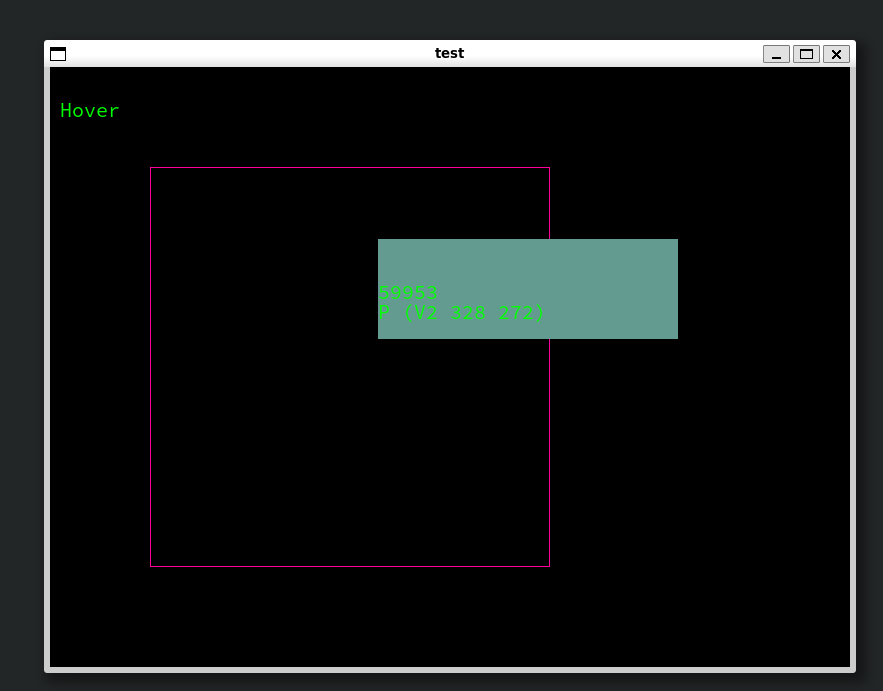
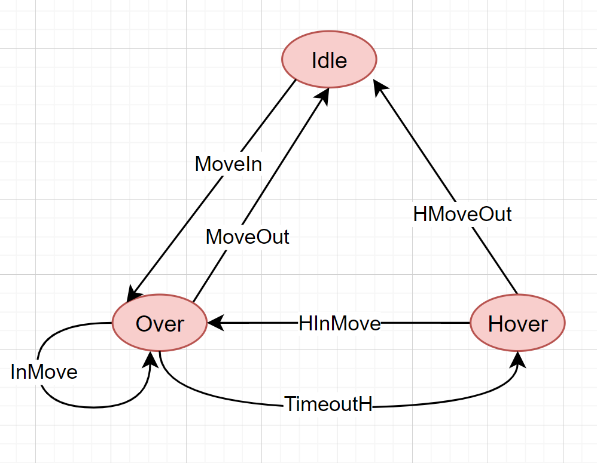

## Introducing McBride Indexed Monads

Here's Edward Kmett's [introduction to Indexed Monads](https://stackoverflow.com/questions/28690448/what-is-indexed-monad).
As he said, there are at least three indexed monads:
  1. Bob Atkey
```haskell
class IMonad m where
  ireturn  ::  a -> m i i a
  ibind    ::  m i j a -> (a -> m j k b) -> m i k b
```
  2. Conor McBride 
```haskell
type a ~> b = forall i. a i -> b i 

class IMonad m where
  ireturn :: a ~> m a
  ibind :: (a ~> m b) -> (m a ~> m b)
```
  3. Dominic Orchard

No detailed description, just a link to this [lecture](https://github.com/dorchard/effect-monad/blob/master/docs/ixmonad-fita14.pdf)。

> In order to use do syntax, the QualifiedDo extension is required. The QualifiedDo extension allows us to overload only the two operators (>>=) and (>>). Prior to ghc 9.10.1, this extension had [serious issues](https://gitlab.haskell.org/ghc/ghc/-/issues/21206). But this [MR](https://gitlab.haskell.org/ghc/ghc/-/merge_requests/10140) fixes these problems! ! The latest ghc 9.10.1 contains this MR. So this library requires you to update the ghc version to 9.10.1.
>> Install ghc 9.10.1 using ghcup
```shell
ghcup install ghc 9.10.1
```

What I want to introduce is the McBride Indexed Monad, the earliest paper [here](https://personal.cis.strath.ac.uk/conor.mcbride/Kleisli.pdf).
The following is the detailed definition of IFunctor, IMonad, (>>=), (>>)
```haskell
infixr 0 ~>

type f ~> g = forall x. f x -> g x

class IFunctor f where
  imap :: (a ~> b) -> f a ~> f b

class (IFunctor m) => IMonad m where
  ireturn :: a ~> m a
  ibind :: (a ~> m b) -> m a ~> m b

(>>=) :: (IMonad (m :: (x -> Type) -> x -> Type)) 
      => m a ix -> (a ~> m b) -> m b ix
m >>= f = ibind f m

data At :: Type -> k -> k -> Type where
  At :: a -> At a k k
  deriving (Typeable)

(>>) :: (IMonad (m :: (x -> Type) -> x -> Type)) 
     => m (At a j) i -> m b j -> m b i
m >> f = ibind (\(At _) -> f) m
```

The following is my understanding of (\~>): through GADT, let the value contain type information, and then use ((\~>), pattern match) to pass the type to subsequent functions

```haskell
data V = A | B 

data SV :: V -> Type where  -- GADT, let the value contain type information
   SA :: SV A
   SB :: SV B

data SV1 :: V -> Type where
   SA1 :: SV1 A
   SB1 :: SV1 B

fun :: SV ~> SV1     -- type f ~> g = forall x. f x -> g x
fun sv = case sv of  -- x is arbitrary but f, g must have the same x
     SA -> SA1       -- Pass concrete type state to subsequent functions via pattern matching
     SB -> SB1


class (IFunctor m) => IMonad m where
  ireturn :: a ~> m a
  ibind :: (a ~> m b)  -- The type information contained in a will be passed to (m b), which is exactly what we need: external input has an impact on the type!
        -> m a ~> m b
``` 

## Introducing typed-fsm
FSM stands for [Finite State Machine](https://en.wikipedia.org/wiki/Finite-state_machine), which is widely used in programs. This library is inspired by [typed-protocols](https://github.com/input-output-hk/typed-protocols).


Using typed-fsm will go through the following five steps:

1. Define status
2. Define state transfer messages
3. Build status processing function
4. Construct functions from events to messages in different states
5. Running status processing function

Don't worry, it's explained in detail in the Mouse Motion example below.

The core of typed-fsm is simple
```haskell
-- ps means status

-- State transfer message type class
class StateTransMsg ps where
  data Msg ps (st :: ps) (st' :: ps)

-- Core AST, essentially all we do is build this AST and then interpret it
-- (Operate m ia st) is an instance of IMonad, and it contains an m internally
data Operate :: (Type -> Type) -> (ps -> Type) -> ps -> Type where
  IReturn :: ia (mode :: ps) -> Operate m ia mode
  LiftM
    :: ( SingI mode
       , Reify mode
       , SingI mode'
       , Reify mode'
       )
    => m (Operate m ia mode')
    -> Operate m ia mode
  In
    :: forall ps m (from :: ps) ia
     . (Msg ps from ~> Operate m ia)
    -> Operate m ia from

-- instance IFunctor
instance (Functor m) => IFunctor (Operate m) where
  imap f = \case
    IReturn ia -> IReturn (f ia)
    LiftM f' -> LiftM (fmap (imap f) f')
    In cont -> In (imap f . cont)

-- instance IMonad
instance (Functor m) => IMonad (Operate m) where
  ireturn = IReturn
  ibind f = \case
    IReturn ia -> (f ia)
    LiftM m -> LiftM (fmap (ibind f) m)
    In cont -> In (ibind f . cont)
```

typed-fsm only contains two core functions: getInput, liftm. We use these two functions to build Operate.
The overall behavior is as follows: constantly reading messages from the outside and converting them into internal monads.

getInput: reads messages from outside
```haskell
getInput :: forall ps m (from :: ps). (Functor m) 
         => Operate m (Msg ps from) from
getInput = In ireturn
```
liftm: lifts the internal m, to Operate
```haskell
liftm :: forall ps m (mode :: ps) a
       . (Functor m, SingI mode, Reify mode) 
      => m a -> Operate m (At a mode) mode
liftm m = LiftM (returnAt <$> m)
```
# Example
## Run example
1. Install ghc 9.10.1 using ghcup [Enough help here](https://discourse.haskell.org/t/ghc-9-10-1-alpha1-is-now-available/9048)
2. cabal run motion  --flags="BuildExample"

## Example explanation


> There is a box in the picture. When the mouse is outside the box, the status is Idle.
> When the mouse moves inside the box, the status changes to Over.

> When entering the Over state, a timer will be turned on.
>> 1. If the timer times out, enter the Hover state, cancel the timer, and display some information on the upper right corner of the mouse.
>> 2. If the mouse moves out of the box, the status changes to Idle and the timer is cancelled.
>> 3. If the mouse moves within the box, update the timer to prevent entering the Hover state.

> When entering Hover state
>> 1. If the mouse moves within the box, open a new timer and enter the Over state
>> 2. If the mouse moves outside the box, then enter the Idle state

### 1. Define status
```haskell
data Motion
  = Idle
  | Over
  | Hover
  deriving (Show)
```
### 2. Define state transfer messages

```haskell
instance StateTransMsg Motion where
  data Msg Motion from to where
    MoveIn :: Point' -> Timestamp -> Msg Motion Idle Over
    -----------------
    MoveOut :: Msg Motion Over Idle
    InMove :: Point' -> Timestamp -> Msg Motion Over Over
    TimeoutH :: Msg Motion Over Hover
    -----------------
    HInMove :: Point' -> Timestamp -> Msg Motion Hover Over
    HMoveOut :: Msg Motion Hover Idle
```

### 3. Build status processing function

```haskell

timeoutSize :: Int
timeoutSize = 400_000

-- Register timer
myRegisterTimeout :: StateT MotionState IO (TimerManager, TimeoutKey)
myRegisterTimeout = do
  chan <- use channel
  liftIO $ do
    tm <- getSystemTimerManager
    tk <- registerTimeout tm timeoutSize (atomically $ writeTChan chan ())
    pure (tm, tk)
```

```haskell
idelHandler :: Op Motion MotionState Idle Idle  -- Initial state Idle, final state Idle
idelHandler = I.do
  msg <- getInput
  case msg of
    MoveIn pos tms -> I.do                     -- Message generated when the mouse moves inside the box
      At tp <- liftm $ do   
        mousePos .= pos
        (tm, tk) <- myRegisterTimeout          -- Register timer
        pure (tm, tk, tms)
      overHandler tp                           -- Enter overHandler
```

```haskell
overHandler :: (TimerManager, TimeoutKey, Timestamp) -> Op Motion MotionState Idle Over  -- Initial state Over, final state Idle
overHandler (tm, tk, oldtms) = I.do
  msg <- getInput
  case msg of
    MoveOut -> I.do                                -- Message generated when the mouse moves out of the box
      liftm $ liftIO $ unregisterTimeout tm tk     -- Cancel timer
      idelHandler                                  -- Enter idleHandler
    InMove pos tms -> I.do     -- Message generated when the mouse moves inside the box
      liftm $ do
        mousePos .= pos
      if tms - oldtms > 40    -- Compare InMove message timestamps to update the timer less frequently
        then I.do
          liftm $ liftIO $ updateTimeout tm tk timeoutSize   -- Update timer to prevent entering Hover state
          overHandler (tm, tk, tms)               -- Enter the overHandler. It can be seen from the state transition diagram that the InMove message will not change the Over state.
        else overHandler (tm, tk, oldtms)
    TimeoutH -> I.do       -- A message generated when the mouse remains in the box for more than the set 400ms.
      liftm $ do
        liftIO $ unregisterTimeout tm tk   -- Cancel timer
        pos <- use mousePos
        onHover .= Just (pos, [show oldtms, show pos]) 
      hoverHandler   -- Enter hoverHandler
```

```haskell
hoverHandler :: Op Motion MotionState Idle Hover  -- Initial state Hover, final state Idle
hoverHandler = I.do
  msg <- getInput
  case msg of
    HInMove pos tms -> I.do  -- Message generated when the mouse moves in the box
      At tp <- liftm $ do
        mousePos .= pos
        onHover .= Nothing
        (tm, tk) <- myRegisterTimeout  -- Register timer
        pure (tm, tk, tms)
      overHandler tp     -- Enter overHandler
    HMoveOut -> I.do  -- Message generated when the mouse moves out of the box
      liftm $ onHover .= Nothing
      idelHandler    -- Enter idelHandler
```

### 4. Construct functions from events to messages in different states
The event represents an external input event, in this example it represents an sdl Event (wrapped here with MyEvent).

Message represents a state transfer message, in this example:
```haskell
    MoveIn :: Point' -> Timestamp -> Msg Motion Idle Over
    MoveOut :: Msg Motion Over Idle
    InMove :: Point' -> Timestamp -> Msg Motion Over Over
    TimeoutH :: Msg Motion Over Hover
    HInMove :: Point' -> Timestamp -> Msg Motion Hover Over
    HMoveOut :: Msg Motion Hover Idle
```

In different states, there are different mappings of events to messages.
```haskell
data SomeMsg ps from
  = forall (to :: ps).
    (SingI to, Reify to) =>
    SomeMsg (Msg ps from to)

newtype GenMsg ps state event from
  = GenMsg (state -> event -> Maybe (SomeMsg ps from))

-- Indicates how events are converted into messages in different states
-- Ensure that no erroneous messages are generated through dependent-map
type State2GenMsg ps state event = DMap (Sing @ps) (GenMsg ps state event)
```

The functions in this example from events to messages in different states.
```haskell
mouseDepMap :: State2GenMsg Motion MotionState MyEvent
mouseDepMap =
  D.fromList
    [ SIdel
        :=> GenMsg
          ( \(MotionState rect' _ _ _) event -> case event of
              MyMouseMotion (fmap fromIntegral -> p) tms ->
                if rect' `contains` p
                  then Just $ SomeMsg (MoveIn p tms)
                  else Nothing
              _ -> Nothing
          )
    , SOver
        :=> GenMsg
          ( \(MotionState rect' _ _ _) event -> case event of
              MyMouseMotion (fmap fromIntegral -> p) tms ->
                if rect' `contains` p
                  then Just $ SomeMsg (InMove p tms)
                  else Just $ SomeMsg MoveOut
              MyTimeout -> Just $ SomeMsg TimeoutH
          )
    , SHover
        :=> GenMsg
          ( \(MotionState rect' _ (Point mx my) _) event -> case event of
              MyMouseMotion (fmap fromIntegral -> p@(Point x y)) tms ->
                if rect' `contains` p
                  then
                    if abs (mx - x) < 30 && abs (my - y) < 30
                      then Nothing
                      else
                        Just $ SomeMsg (HInMove p tms)
                  else Just $ SomeMsg HMoveOut
              _ -> Nothing
          )
    ]
```
### 5. Running status processing function

Interpret (Operate m ia s) to m.
The m here uses specific (StateT state IO). I tend to use a simple State + IO monad here. In principle, we do not need complex control flow monads, fsm itself represents control flow. runOp is a very general function. Of course, the entire interpretation code is very simple. You can customize your own interpretation code at will.

```haskell
runOp
  :: forall ps event state a (input :: ps) (output :: ps)
   . ( SingI input
     , Reify input
     , GCompare (Sing @ps)
     )
  => State2GenMsg ps state event    -- Event to message function in different states
  -> [event]                        -- List of external input events
  -> Operate (StateT state IO) (At a output) input       -- Operate AST
  -> (StateT state IO) (OpResult ps (StateT state IO) a) -- The underlying m, here is the specific (StateT state IO)
runOp dmp evns = \case
  IReturn (At a) -> pure (Right a)       
  LiftM m -> m Prelude.>>= runOp dmp evns
  In f -> do                  -- Interpret function f
    case D.lookup (sing @input) dmp of -- Find the corresponding event generation message function based on the current status
      Nothing -> error "np"           -- If not found, report an error directly
      Just (GenMsg genMsg) -> loop evns  -- Found the corresponding function
       where
        loop [] = pure $ Left $ SomeOperate (In f) -- If there are not enough events, return the function and wait for the next event to be executed.
        loop (et : evns') = do
          state' <- get
          case genMsg state' et of
            Nothing -> loop evns'   -- The function did not generate a message, discard the event and try the next event
            Just (SomeMsg msg) -> runOp dmp evns' (f msg) -- The function generates a message, f uses the message to generate a new Operate and interprets it
```

## Advantages of type-fsm
1. Focus on the right message

2. Top-to-bottom design for easy refactoring

3. Conducive to building complex state machine systems

  + Type guarantees will not produce incorrect function calls when written
  + With the help of the type system, we can define many state processing functions and then call each other recursively with confidence.

4. There is a sanity check. If you miss some items for pattern matching, the compiler will issue a warning, and there will also be a warning for invalid items.

## Some of my own feelings
   1. McBride Indexed Monads don't stop there. During the construction phase, the AST section can track the impact of different inputs on types, which is particularly suitable for processing state machine models with interactions.
  
   2. [type-protocols](https://github.com/input-output-hk/typed-protocols/issues/25) Typed communication protocol, this library focuses on communication between client-server. I believe it should be easily extendable to communication protocols involving more actors.
  
   3. Can be used for gui and game development. For example, the mouse motion example above

   4. Finite state machines have a wide range of applications. I hope to be able to write code in a high-level type system, generate low-level code, and deploy it to the corresponding machine. Similar to [fir](https://gitlab.com/sheaf/fir/-/tree/master).

## If you have any questions or suggestions, please send me a message.
I'm interested in participating in any projects that want to take advantage of this library or use McBride Indexed Monads.
McBride Indexed Monad has extraordinary significance to haskell!!!
